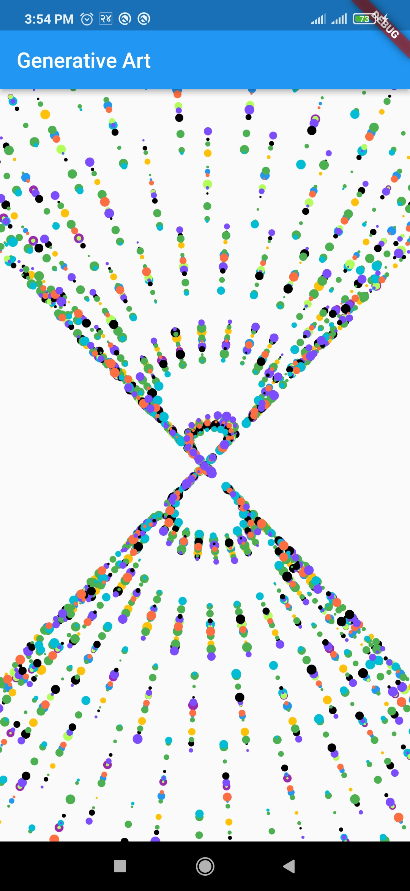
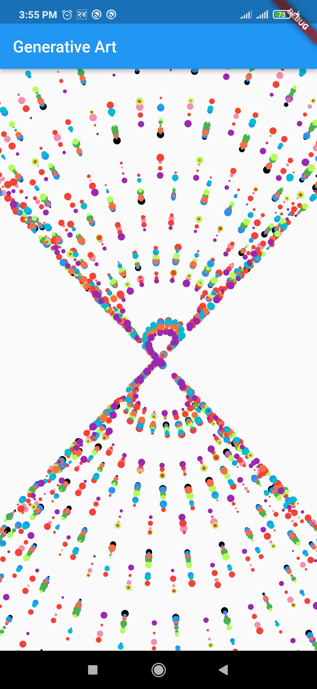
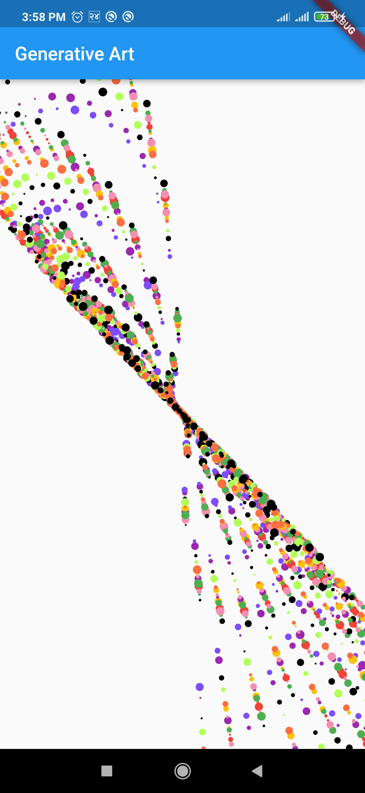
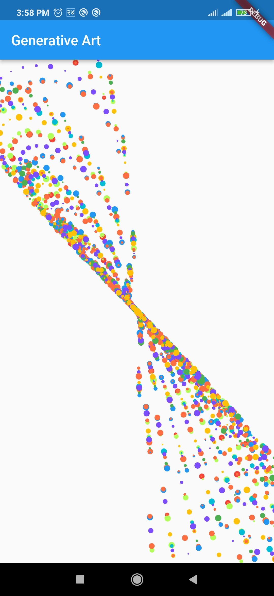

# Generative Art

Simple Generative Art made with basic trigonometric functions.

Also, later on added a REFRESH button on the appbar for changing the different colors output from the app on pressing the REFRESH button

## Screenshots

  
  
  
  

